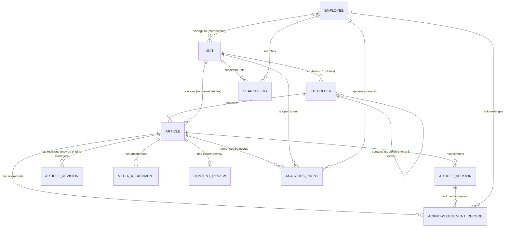

> **About this document**
>
> **What:** Concrete entity-relationship draft for the Knowledge Base feature. Transforms the Conceptual Model's 9 entities into PostgreSQL table definitions with fields, types, relationships, constraints, and notes for the dev team.
> **Why:** Gives the dev team a starting point for database schema design. This is a DRAFT -- the actual schema depends on Sprint 0 engine evaluation results (which data lives in the engine's DB vs Employo's DB).
> **Stage:** Delivery Preparation -- Discovery: Knowledge Base

> **IMPORTANT CAVEAT**
>
> This is a DRAFT starting point, NOT a final schema. Every decision here is marked "proposed -- tech lead validates." The actual schema depends on:
> 1. Sprint 0 Spike 1 results (which engine is selected, what data it manages)
> 2. Sprint 0 Spike 2 results (dual data store architecture: shared DB, synced metadata, or API joins)
> 3. Tech lead review of field types, index strategy, and naming conventions
>
> **Status:** draft -- 2026-04-22

---

# Data Model Draft -- Knowledge Base

## Entity Relationship Diagram



---

## Dual Data Store Mapping

Under Concept B (Open-Source KB Core + HR Shell), data is split between two PostgreSQL schemas (proposed -- Sprint 0 Spike 2 validates).

| Entity | Data Store | Rationale |
|---|---|---|
| **Article** (content, title, body) | Engine DB (e.g., Docmost schema) | Engine handles content CRUD, editing, storage |
| **Article** (HR metadata: content_type, review_date, requires_ack, owner, language, status override) | Employo DB | HR-specific fields the engine does not know about |
| **ArticleVersion** | Engine DB (version snapshots) + Employo DB (version-to-ack mapping) | Engine manages version content; Employo maps versions to ack triggers |
| **ArticleRevision** | Engine DB | Engine handles auto-save and revision tracking |
| **KBFolder** | Engine DB or Employo DB (TBD Sprint 0) | Depends on engine's folder/hierarchy API capability |
| **MediaAttachment** | Engine DB + storage | Engine handles file upload and storage |
| **AcknowledgementRecord** | Employo DB (EXCLUSIVELY) | HR-specific, legally sensitive, immutable. Never in engine |
| **ContentReview** | Employo DB | HR-specific freshness tracking |
| **SearchLog** | Employo DB | Employo-managed analytics |
| **AnalyticsEvent** | Employo DB | Employo-managed analytics |

**Cross-store reference strategy (proposed -- tech lead validates):**
- Employo DB stores `engine_article_id` (the engine's internal ID) as a foreign reference
- All Employo-side entities reference articles via this `engine_article_id`
- If shared-database architecture is chosen (Sprint 0 Spike 2, Option C), cross-schema JOINs are possible directly

---

## Entity Definitions

### 1. KBFolder

**Proposed -- tech lead validates. May live entirely in engine DB depending on Sprint 0 Spike 1 findings.**

| Field | Type | Nullable | Default | Description |
|---|---|---|---|---|
| `id` | UUID | No | gen_random_uuid() | Primary key |
| `unit_id` | UUID | No | — | FK to Employo Unit. Scopes this folder to a Unit |
| `parent_folder_id` | UUID | Yes | NULL | FK to KBFolder. NULL = top-level folder in Unit's KB |
| `name` | VARCHAR(100) | No | — | Folder display name. Must be non-empty |
| `display_order` | INTEGER | No | 0 | Sort order within parent container |
| `depth` | SMALLINT | No | 1 | 1 = top-level, 2 = subfolder, 3 = nested subfolder. Max: 3 |
| `article_count` | INTEGER | No | 0 | Denormalized count of published articles (including in subfolders). Updated on publish/archive/delete |
| `created_at` | TIMESTAMPTZ | No | NOW() | Creation timestamp |
| `created_by` | UUID | No | — | FK to Employo User |
| `updated_at` | TIMESTAMPTZ | No | NOW() | Last modification timestamp |

**Constraints:**
- UNIQUE(parent_folder_id, name) -- folder name unique within parent. For top-level folders: UNIQUE(unit_id, name) WHERE parent_folder_id IS NULL
- CHECK(depth BETWEEN 1 AND 3) -- enforce max 3 levels
- CHECK(LENGTH(name) > 0) -- non-empty name

**Relationships:**
- KBFolder -> Unit (many-to-one)
- KBFolder -> KBFolder (self-referential, many-to-one for parent)
- KBFolder -> Article (one-to-many)

**Notes for dev team:**
- The `depth` field is denormalized for performance (avoids recursive queries to check depth limit)
- When moving a folder, recalculate `depth` for the folder and all descendants. Block if any would exceed 3
- `article_count` is denormalized. Consider updating via trigger or application code on article publish/archive/delete

---

### 2. Article (Employo HR Metadata)

**This entity represents Employo's HR-specific metadata overlay on top of the engine's article.**

| Field | Type | Nullable | Default | Description |
|---|---|---|---|---|
| `id` | UUID | No | gen_random_uuid() | Employo-side primary key |
| `engine_article_id` | VARCHAR(255) | No | — | Foreign reference to the article in the engine's database. Format depends on engine |
| `unit_id` | UUID | No | — | FK to Employo Unit. Scopes article to a Unit |
| `folder_id` | UUID | Yes | NULL | FK to KBFolder. NULL = article at KB root level |
| `content_type` | VARCHAR(20) | Yes | NULL | Enum: policy, playbook, checklist, faq, how-to, other |
| `status` | VARCHAR(20) | No | 'draft' | Enum: draft, published, archived |
| `owner_id` | UUID | No | — | FK to Employo User. Defaults to creator |
| `language` | VARCHAR(5) | No | 'uk' | ISO 639-1 code. Default Ukrainian |
| `requires_acknowledgement` | BOOLEAN | No | FALSE | Whether this article requires employee ack |
| `ack_type` | VARCHAR(20) | Yes | NULL | Enum: understanding (iteration 1). Agreement (iteration 2) |
| `is_mandatory_onboarding` | BOOLEAN | No | FALSE | Whether this article is mandatory for new employee onboarding |
| `onboarding_order` | INTEGER | Yes | NULL | Sort order for onboarding flow. NULL if not mandatory |
| `review_date` | DATE | Yes | NULL | Next review date. NULL = no review tracking |
| `review_status` | VARCHAR(20) | Yes | NULL | Enum: fresh, aging, stale, expired. NULL if no review_date set |
| `last_reviewed_at` | TIMESTAMPTZ | Yes | NULL | When last review was completed |
| `last_reviewed_by` | UUID | Yes | NULL | FK to Employo User who completed last review |
| `current_version_number` | VARCHAR(10) | No | '1.0' | Current published version (e.g., '1.0', '2.0') |
| `published_at` | TIMESTAMPTZ | Yes | NULL | When first published. NULL if still Draft |
| `published_by` | UUID | Yes | NULL | FK to Employo User who published |
| `created_at` | TIMESTAMPTZ | No | NOW() | Creation timestamp |
| `created_by` | UUID | No | — | FK to Employo User |
| `updated_at` | TIMESTAMPTZ | No | NOW() | Last modification timestamp |
| `title_snapshot` | VARCHAR(200) | No | — | Copy of article title for Employo-side queries without engine join |

**Constraints:**
- UNIQUE(engine_article_id) -- one Employo metadata record per engine article
- CHECK(status IN ('draft', 'published', 'archived'))
- CHECK(content_type IN ('policy', 'playbook', 'checklist', 'faq', 'how-to', 'other') OR content_type IS NULL)
- CHECK(review_status IN ('fresh', 'aging', 'stale', 'expired') OR review_status IS NULL)
- CHECK(language IN ('uk', 'en'))

**Relationships:**
- Article -> Unit (many-to-one)
- Article -> KBFolder (many-to-one, optional)
- Article -> ArticleVersion (one-to-many)
- Article -> MediaAttachment (one-to-many)
- Article -> AcknowledgementRecord (one-to-many)
- Article -> ContentReview (one-to-many)
- Article -> AnalyticsEvent (one-to-many)

**Notes for dev team:**
- `title_snapshot` is denormalized from the engine to avoid cross-DB joins for listing queries. Update on every engine-side title change
- `review_status` is updated by a scheduled job (requires shared job scheduler from Sprint 0 Spike 3). Transition logic: Fresh (>30 days to review_date) -> Aging (<=30 days) -> Stale (review_date passed) -> Expired (>30 days past review_date)
- The engine manages the actual article content (title, body, etc.). This table is the HR metadata overlay
- `status` in this table is Employo's view. If the engine also has status, Employo's status takes precedence for permission-based visibility

---

### 3. ArticleVersion

**Maps engine version snapshots to Employo's ack/compliance tracking.**

| Field | Type | Nullable | Default | Description |
|---|---|---|---|---|
| `id` | UUID | No | gen_random_uuid() | Primary key |
| `article_id` | UUID | No | — | FK to Article (Employo metadata) |
| `engine_version_id` | VARCHAR(255) | Yes | NULL | Foreign reference to engine's version record (if engine tracks versions) |
| `version_number` | VARCHAR(10) | No | — | Display version (e.g., '1.0', '2.0') |
| `change_summary` | TEXT | Yes | NULL | Free-text summary of what changed (author-provided) |
| `triggers_re_ack` | BOOLEAN | No | FALSE | Whether this version triggers re-acknowledgement |
| `created_at` | TIMESTAMPTZ | No | NOW() | When this version was published |
| `created_by` | UUID | No | — | FK to Employo User who published this version |

**Constraints:**
- UNIQUE(article_id, version_number) -- no duplicate version numbers per article

**Relationships:**
- ArticleVersion -> Article (many-to-one)
- ArticleVersion -> AcknowledgementRecord (one-to-many)

**Notes for dev team:**
- The actual content snapshot lives in the engine's version history. This table tracks the Employo-side metadata (ack triggers, change summary)
- `triggers_re_ack` is set by the author at publish time (checkbox: "Require re-acknowledgement for this version")
- Version numbering is sequential integers displayed as X.0 (1.0, 2.0, etc.). Revisions do not get version numbers

---

### 4. ArticleRevision

**Proposed -- may be entirely engine-managed. Included here for completeness.**

| Field | Type | Nullable | Default | Description |
|---|---|---|---|---|
| `id` | UUID | No | gen_random_uuid() | Primary key |
| `article_id` | UUID | No | — | FK to Article |
| `engine_revision_id` | VARCHAR(255) | Yes | NULL | Foreign reference to engine's revision/history record |
| `changed_by` | UUID | No | — | FK to Employo User |
| `changed_at` | TIMESTAMPTZ | No | NOW() | Revision timestamp |

**Notes for dev team:**
- If the engine manages revision history natively (Docmost/Outline likely do), this table may not be needed
- Employo only needs revisions for the edit history log (E1.S11 AC 8)
- Sprint 0 Spike 1 should confirm whether the engine exposes revision history via API

---

### 5. MediaAttachment

**Proposed -- may be partially or fully engine-managed.**

| Field | Type | Nullable | Default | Description |
|---|---|---|---|---|
| `id` | UUID | No | gen_random_uuid() | Primary key |
| `article_id` | UUID | No | — | FK to Article |
| `engine_file_id` | VARCHAR(255) | Yes | NULL | Foreign reference to engine's file storage |
| `file_name` | VARCHAR(255) | No | — | Original file name |
| `file_type` | VARCHAR(10) | No | — | Extension: pdf, docx, xlsx, pptx, png, jpg, gif, svg |
| `file_size_bytes` | BIGINT | No | — | File size in bytes |
| `is_inline_image` | BOOLEAN | No | FALSE | True if image inserted inline in article body |
| `is_cover_image` | BOOLEAN | No | FALSE | True if this is the article's cover image |
| `storage_url` | TEXT | No | — | URL or path to file in storage |
| `uploaded_by` | UUID | No | — | FK to Employo User |
| `uploaded_at` | TIMESTAMPTZ | No | NOW() | Upload timestamp |

**Constraints:**
- CHECK(file_size_bytes <= 26214400) -- 25MB max per file
- CHECK(file_type IN ('pdf', 'docx', 'xlsx', 'pptx', 'png', 'jpg', 'gif', 'svg'))

**Relationships:**
- MediaAttachment -> Article (many-to-one)

**Notes for dev team:**
- Cascade deletion: when article is deleted, ALL attachments are permanently deleted
- When article is edited, attachments persist unless explicitly removed by author
- Max 20 non-inline attachments per article (enforced at application level)
- If engine manages file storage natively, this table may be a metadata mirror or unnecessary

---

### 6. AcknowledgementRecord

**CRITICAL: This table is IMMUTABLE. No UPDATE or DELETE operations. Employo DB only.**

| Field | Type | Nullable | Default | Description |
|---|---|---|---|---|
| `id` | UUID | No | gen_random_uuid() | Unique, system-generated. Cannot be reused |
| `employee_id` | UUID | No | — | FK to Employo User (employee who acknowledged) |
| `employee_name_snapshot` | VARCHAR(200) | No | — | Employee name at time of ack (for report readability) |
| `article_id` | UUID | No | — | FK to Article |
| `article_title_snapshot` | VARCHAR(200) | No | — | Article title at time of ack (retained even if article deleted) |
| `article_version_id` | UUID | No | — | FK to ArticleVersion (specific version acknowledged) |
| `version_number_snapshot` | VARCHAR(10) | No | — | Version number at time of ack |
| `ack_type` | VARCHAR(20) | No | 'understanding' | Enum: understanding. (agreement in iteration 2) |
| `method` | VARCHAR(30) | No | 'electronic_click' | How the ack was recorded |
| `ip_address` | INET | Yes | NULL | Optional. Captured only if customer opted in. Default: NULL |
| `acknowledged_at` | TIMESTAMPTZ | No | NOW() | UTC timestamp of acknowledgement |
| `timezone` | VARCHAR(50) | Yes | NULL | User's session timezone (e.g., 'Europe/Kyiv') |
| `status` | VARCHAR(30) | No | 'completed' | Enum: completed, pending, re_ack_required, cancelled, employee_deactivated |
| `pending_since` | TIMESTAMPTZ | Yes | NULL | When this pending ack was created (for overdue calculation) |
| `cancelled_at` | TIMESTAMPTZ | Yes | NULL | When this ack was cancelled (if article archived or Unit restructured) |
| `cancelled_reason` | VARCHAR(100) | Yes | NULL | Reason for cancellation (e.g., 'article_archived', 'unit_restructured') |

**Constraints:**
- No UPDATE trigger: `CREATE RULE ack_no_update AS ON UPDATE TO acknowledgement_record DO INSTEAD NOTHING;` (proposed -- tech lead validates enforcement mechanism)
- No DELETE trigger: `CREATE RULE ack_no_delete AS ON DELETE TO acknowledgement_record DO INSTEAD NOTHING;` (proposed -- tech lead validates; GDPR retention purge handled separately via privileged process)
- UNIQUE(employee_id, article_version_id) WHERE status = 'completed' -- one completed ack per employee per version

**Relationships:**
- AcknowledgementRecord -> Employee (many-to-one)
- AcknowledgementRecord -> Article (many-to-one)
- AcknowledgementRecord -> ArticleVersion (many-to-one)

**Notes for dev team:**
- This is the most legally sensitive table in the KB. Treat with extreme care
- Snapshot fields (employee_name_snapshot, article_title_snapshot, version_number_snapshot) ensure records remain meaningful even if the source entity is deleted or renamed
- `status` field progression: pending -> completed (employee acknowledges) OR pending -> re_ack_required (new version published) OR pending -> cancelled (article archived / Unit restructured) OR pending -> employee_deactivated (employee leaves)
- For completed records: acknowledged_at is populated, pending_since is the original creation time
- For pending records: acknowledged_at is NULL, pending_since is populated
- "Overdue" is calculated as: status = 'pending' AND NOW() - pending_since > overdue_threshold (default 14 days)
- Immutability enforcement: application code never issues UPDATE/DELETE. Database-level rules/triggers as backup. GDPR retention purge runs as a separate privileged process with its own audit log
- Sprint 0 prerequisite: tech lead designs the immutable record schema, database role strategy (REVOKE UPDATE/DELETE on ack table), and ORM constraints

---

### 7. ContentReview

| Field | Type | Nullable | Default | Description |
|---|---|---|---|---|
| `id` | UUID | No | gen_random_uuid() | Primary key |
| `article_id` | UUID | No | — | FK to Article |
| `reviewer_id` | UUID | No | — | FK to Employo User (typically article owner) |
| `review_action` | VARCHAR(20) | No | — | Enum: confirmed_current, updated |
| `review_notes` | TEXT | Yes | NULL | Optional free-text notes from reviewer |
| `reviewed_at` | TIMESTAMPTZ | No | NOW() | When the review was completed |

**Relationships:**
- ContentReview -> Article (many-to-one)

**Notes for dev team:**
- Each review creates a new record (audit trail of reviews)
- "confirmed_current" = article content is still accurate, no changes needed. Resets freshness to Fresh
- "updated" = article was edited. May or may not trigger new version depending on author's choice
- Review history visible in admin view (E3.S11)

---

### 8. SearchLog

| Field | Type | Nullable | Default | Description |
|---|---|---|---|---|
| `id` | UUID | No | gen_random_uuid() | Primary key |
| `user_id` | UUID | No | — | FK to Employo User. Personal data -- see GDPR notes |
| `unit_id` | UUID | No | — | Unit context of the search |
| `query_text` | TEXT | No | — | Search query (trimmed, lowercased) |
| `result_count` | INTEGER | No | — | Number of results returned |
| `is_zero_result` | BOOLEAN | No | FALSE | True if query returned 0 results |
| `clicked_article_id` | UUID | Yes | NULL | FK to Article (if user clicked a result) |
| `session_id` | VARCHAR(100) | Yes | NULL | Groups queries within a 5-minute window |
| `is_admin_search` | BOOLEAN | No | FALSE | True if search was from admin view (excluded from employee analytics) |
| `searched_at` | TIMESTAMPTZ | No | NOW() | Timestamp |

**Constraints:**
- Retention: 12 months default (configurable). Auto-purge via scheduled job
- Queries shorter than 2 characters are NOT logged

**Notes for dev team:**
- `user_id` is personal data under GDPR. When user exercises right to erasure, replace with anonymous session ID or delete
- `session_id` groups multiple searches within 5 minutes by the same user (for search analytics session grouping)
- Admin searches (is_admin_search = TRUE) are excluded from employee-facing analytics (E4) but retained for system analytics

---

### 9. AnalyticsEvent

| Field | Type | Nullable | Default | Description |
|---|---|---|---|---|
| `id` | UUID | No | gen_random_uuid() | Primary key |
| `event_type` | VARCHAR(30) | No | — | Enum: article_view, article_ack_completed, search_query, search_zero_results, helpfulness_vote_up, helpfulness_vote_down, helpfulness_vote_removed |
| `user_id` | UUID | No | — | FK to Employo User |
| `article_id` | UUID | Yes | NULL | FK to Article (NULL for search events) |
| `article_version_id` | UUID | Yes | NULL | FK to ArticleVersion |
| `unit_id` | UUID | No | — | User's primary Unit at time of event |
| `search_query` | TEXT | Yes | NULL | For search events: the query text |
| `metadata` | JSONB | Yes | NULL | Extensible field for event-specific data |
| `created_at` | TIMESTAMPTZ | No | NOW() | Event timestamp |

**Constraints:**
- Events are append-only. No UPDATE or DELETE via application code
- Deduplication: article_view events for same user + article within 30-minute sliding window create only one record. Dedup key: user_id + article_id
- Retention: 24 months raw events (configurable). Older events aggregated into daily/weekly summaries, raw events purged

**Notes for dev team:**
- Events are written asynchronously -- do not block user interactions
- `metadata` JSONB field allows adding event-specific data without schema changes (e.g., device type, referrer)
- Daily summary aggregation schema: article_id, date, total_views, unique_viewers, total_ack_completed, total_helpfulness_up, total_helpfulness_down
- Weekly summary aggregation schema: unit_id, week_start_date, total_views, unique_viewers, total_searches, zero_result_searches

---

### 10. AuditTrailEntry (for Acknowledgement)

| Field | Type | Nullable | Default | Description |
|---|---|---|---|---|
| `id` | UUID | No | gen_random_uuid() | Primary key |
| `article_id` | UUID | No | — | FK to Article |
| `event_type` | VARCHAR(50) | No | — | See event types below |
| `actor_id` | UUID | Yes | NULL | FK to Employo User who performed the action. NULL for system events |
| `details` | JSONB | No | — | Event-specific details (employee count, version number, etc.) |
| `created_at` | TIMESTAMPTZ | No | NOW() | Event timestamp |

**Event types:**
- `ack_requirement_enabled` -- admin toggled ack requirement on
- `ack_requirement_disabled` -- admin toggled ack requirement off
- `article_published` -- article published (version N)
- `ack_recorded` -- employee acknowledged (details: employee_id, version)
- `re_ack_triggered` -- new version published with re-ack (details: version, employee_count)
- `reminder_sent` -- admin sent reminder (details: employee_count)
- `article_archived` -- article archived (details: pending_acks_cancelled count)
- `pending_acks_cancelled` -- acks cancelled due to archive or restructure (details: reason, count)
- `retention_purge` -- GDPR retention purge executed (details: records_purged count)

**Constraints:**
- Append-only. No UPDATE or DELETE
- Cannot be modified by any user including Org Admin

**Notes for dev team:**
- Exportable as CSV or PDF per article (E3.S9)
- Export file naming: audit_trail_[article-slug]_[date].csv or .pdf
- Separate from AnalyticsEvent -- this is a compliance artifact, not a usage metric

---

## Unit-Scoping at Data Level

### How Unit-scoping works in the database

Every content entity (Article, KBFolder) has a `unit_id` field that scopes it to a specific Unit. The access control pattern is:

```sql
-- Reader access: "show me articles I can see"
SELECT a.*
FROM article a
WHERE a.status = 'published'
  AND a.unit_id IN (
    -- User's direct Unit memberships
    SELECT unit_id FROM unit_membership WHERE employee_id = :user_id
    UNION
    -- Parent Units of user's Units (inheritance chain)
    SELECT ancestor_unit_id FROM unit_hierarchy
    WHERE descendant_unit_id IN (
      SELECT unit_id FROM unit_membership WHERE employee_id = :user_id
    )
  );
```

**Key principles:**
1. `unit_id` on every content entity is the PRIMARY access control field
2. Unit hierarchy (parent-child) determines content inheritance
3. No per-article ACLs. No per-folder permissions. Unit membership IS the permission
4. The above query pattern applies to: article listing, search result filtering, folder browsing, ack dashboard scoping, analytics scoping

### Inherited content display

When an article from a parent Unit is displayed in a child Unit's KB:
- The article's `unit_id` points to the PARENT Unit
- Child Units see it because the parent is in their inheritance chain
- The article is displayed with "From [Parent Unit name]" indicator
- The article is READ-ONLY from the child Unit's perspective

### Multi-Unit employees

If an employee belongs to Units A and B:
- Each Unit's KB tab independently queries articles scoped to that Unit + ancestors
- No content bleeds between parallel Units
- "My acknowledgements" page aggregates: `WHERE employee_id = :user_id` (across all Units)

---

## Index Strategy (Proposed)

| Table | Index | Purpose |
|---|---|---|
| article | `(unit_id, status)` | Fast queries for "show published articles in this Unit" |
| article | `(owner_id)` | Fast queries for "articles owned by this user" |
| article | `(review_date, review_status)` | Freshness state transition job |
| article | `(engine_article_id)` UNIQUE | Cross-store reference lookups |
| kb_folder | `(unit_id, parent_folder_id)` | Folder hierarchy within a Unit |
| acknowledgement_record | `(employee_id, status)` | "My pending acknowledgements" query |
| acknowledgement_record | `(article_id, article_version_id, status)` | Per-article ack dashboard |
| acknowledgement_record | `(pending_since)` WHERE status = 'pending' | Overdue ack calculation |
| analytics_event | `(article_id, created_at)` | Per-article analytics queries |
| analytics_event | `(unit_id, event_type, created_at)` | Per-Unit analytics dashboards |
| analytics_event | `(user_id, article_id, created_at)` | Deduplication check (30-min window) |
| search_log | `(unit_id, searched_at)` | Search analytics per Unit |
| search_log | `(is_zero_result, searched_at)` | Failed search analysis |
| audit_trail_entry | `(article_id, created_at)` | Chronological audit trail per article |

**Notes for dev team:**
- Index strategy is proposed. Actual indexes depend on query patterns observed during development
- Consider partial indexes for hot paths (e.g., `WHERE status = 'published'` on article)
- Monitor query performance and add indexes as needed
- pg_stat_statements should be enabled for query performance monitoring

---

## Migration Notes

### What happens when the engine selection changes?

If Sprint 0 Spike 1 results in a different engine or Concept A fallback:

| Scenario | Impact on this data model |
|---|---|
| **Docmost selected** | `engine_article_id` maps to Docmost page ID. Shared PG database likely (separate schemas). Cross-schema JOINs possible |
| **Outline selected** | `engine_article_id` maps to Outline document ID. Separate DB or shared PG with separate schemas. Markdown content needs HTML conversion layer |
| **Wiki.js selected** | `engine_article_id` maps to Wiki.js page ID. GraphQL API for data access. Vue.js frontend mismatch for editor |
| **Concept A fallback** | No engine DB. All content lives in Employo DB. `engine_article_id` field removed. Article entity expands to include title, body (JSONB for TipTap), and all content fields directly |

### If Concept A (no engine):

The Article entity would look like:

| Additional Field | Type | Description |
|---|---|---|
| `title` | VARCHAR(200) | Article title (no longer in engine) |
| `body` | JSONB | TipTap JSON content (no longer in engine) |
| `body_html` | TEXT | Rendered semantic HTML (for search indexing and reader view) |
| `cover_image_url` | TEXT | Cover image storage URL |

All other entities remain the same. The dual data store question disappears entirely.
